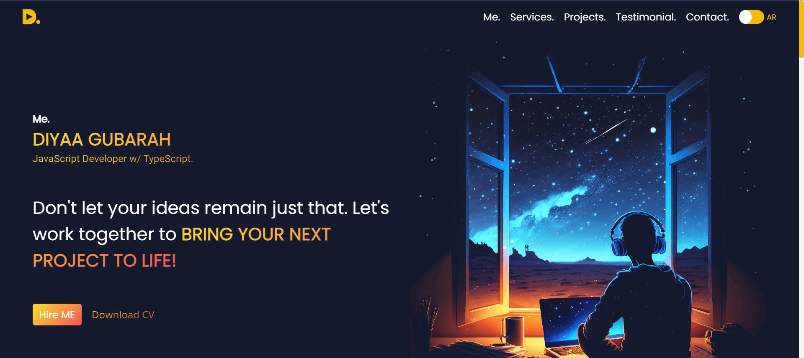

# My Portfolio - Showcasing My Work and Skills

Welcome to my portfolio! This repository serves as a showcase of my projects, skills, and experiences as a developer. Explore my work and learn more about my background and capabilities.

## Project Goals

The primary goals of my portfolio website include:

- **Goal 1**: Enable users to easily navigate and find information about my projects, skills, and experiences.
- **Goal 2**: Provide a visually appealing and responsive design for seamless access on various devices.
- **Goal 3**: Offer a contact form to connect with potential job opportunities or collaborations.

## Technology and Framework

My portfolio website is built using modern web technologies and frameworks:

- **React.js**: A JavaScript library for building user interfaces.
- **Styled-Components**: A library for styling React components.
- **TypeScript**: A typed superset of JavaScript that enhances code robustness.
- **Context**: Used for sharing data between components.
- **Reducer**: Employed for managing the state of the application.

## Features

- Clean and modern design.
- Easy navigation through projects, skills, and experiences.
- Contact form for job opportunities or collaborations.
- Live demo for each project.
- Responsive design for all screen sizes.
- Utilizes the latest technologies and best practices.

## Live Demo

Explore my portfolio live by visiting [My Portfolio Website](https://dyfg.netlify.app/).

## Screenshots

Feel free to contact me if you have any questions or opportunities for collaboration.
